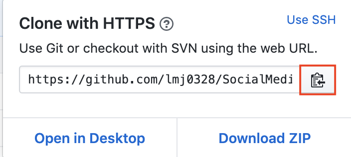
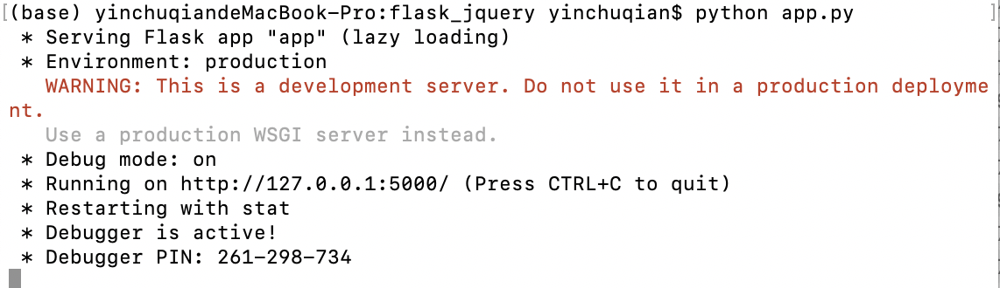

# SocialMediaReport

Here is the link to our [Landing Page](https://lmj0328.github.io/SocialMediaReport/)

Here is the link to our [Demonstration](https://www.youtube.com/watch?v=0ESgZxsGHd8)

## Overview of project
As we enter the information era, social media has become an accessible and convenient way that we rely upon to network with others. While social networking sites turn into an indispensable part of many’s social life, they nevertheless have unfavorable effects on people’s emotions and social well-being to some degree. Since the platform social media provides supports a false reality, it can lead to people’s inaccurate self-awareness. According to Qiu, Lin, and Leung (2010), after social media browsing, “individuals high in narcissism raised their public self-awareness while those low in narcissism reduced their public self-awareness.” Moreover, people with low narcissism perceived their friends’ lives to be better after comparing them with their own, which negatively impacted their emotions. 

In order to address the problem, we started our investigation into people’s interaction with social media. We first completed a thorough review of published materials relating to the influence of social media on people’s overall well-being. Throughout our literature review, we found that social media indeed leads to the younger generation’s pessimistic social well-being, from procrastination to loneliness. To fortify and supplement our findings in this process, we then conducted user research--an online survey to gather more information about people’s experience with social media. As we dived deeper into our potential user’s mind, we were more aware of their situations and the bane of their struggles. In general, many social media users are eager to get positive feedback from their friends--they are undergoing high peer pressure because they often compare themselves with others unconsciously. For the purpose of “feeling good,” they bend the truth sometimes so that they can leave an impression to others that they are having a good life, maybe better than others. Putting on a mask for a long period of time in a virtual world, as a result, can make them forget about their authentic selves and what makes them truly happy. We then defined the crux of the problem as a lack of self-reflection, whose importance and effectiveness are often underestimated nowadays. Eventually, after all our exploration, we formed the information problem statement that we sought to solve later--How might people who are confused about or interested in their identity on social media periodically and accurately self-reflect so that they can know themselves better?

The next step we did was market research: we dug into the existing solutions and then came up with our own. In terms of social media usage management, Apple screen time offers a way to clearly see the time you spend on different social media. It is easy and straightforward to use, but the only thing you can monitor is the time. On the other hand, Spotify wrapped provides a yearly summary of your music history. It has a cool design and lets you know better about your music taste, and yet it’s only about Spotify. In the effort of all the research we did, we synthesized our individual insights, took all the advantages of competitive products, and then combined them to devise our own product--Mirror, which symbolizes self-reflection.

Bearing in mind the relationship between self-reflection and self-awareness, we designed this personal informatics tool, which is a usage report that guides users to learn about their posting activities and self-reflect. The data we collect includes the number of posts they published on each social media platform respectively, the post content that receives the most number of likes, the post published in the timeframe between 10 p.m. to 5 a.m., the top three accounts that they mention most, and so forth. With the exact data extracted from users’ social media along with the data analysis we did, we could provide an easy, enjoyable, and heart-warming way for them to self-reflect deeply, including reminding them of their good memories and highlight moments, giving them numbers and visualizations, etc. Ultimately, users can make adjustments accordingly to experience more positive social well-being.

Our goal was to provide a flexible way for people to improve the quality of their social life under their own consciousness and to have a more positive mindset. We embedded the values of libertarianism and fun into our project as we believe these could make a better user experience. What we do is to give them the real numbers that show their activities on multiple social media platforms and guide them into their own journey to make them feel like reading a pleasant book about themselves. The rest is left in their own hands--they can choose to change their behaviors or not. 

There are also limitations and risks. What we are able to accomplish right now is mainly about Twitter, as we had some challenges scraping data from other social media platforms. If the user would like to know more about their activities on Instagram, Facebook, etc., they would need to count on our future implementations. In addition, some risks like privacy issues may be involved if the user accidentally sets his account to be public and someone else gets his report with our product.

## Closeout/handoff plan
* Step 1: Notify interviewers and survey respondents that our project is being transitioned to open source; with a date that the transition will be effective.
* Step 2: Post a notice on our landing page about the project being transitioned to open source; with a date that the transition will be effective.
* Step 3: Notify any users we collected data from that their data will be deleted; with a date the data deletion will be completed by. Delete all collected data.
* Step 4: Convert the code repository to a public repository.
* Step 5: Add a README document in the public repository with instructions on how to build, continue working on the project.

## Technical Documentation
We used the micro web framework Flask which was written in Python to build up our backend server. It supported us to build the connection between our client-side development and server-side development by allowing sending data back and forth. To keep the consistency of our Python backend, we planned to scrape users’ social media posts from different platforms by using third-party python APIs or write scrapper code by ourselves in python language. We used the python library called [GetOldTweets3](https://pypi.org/project/GetOldTweets3/) to scrape all twitter data and wrote instagram scraping process on our own. While there is no need to construct a real-time database to support the functionality of our product, we saved the data each time into variables and passed them into the data wrangling code. We used pandas library in Python to process the data and summarize the results which would be shown on the final report. In terms of frontend implementation, we used jquery in Javascript to receive data from our backend and generate the interactive report. Last but not the least, we drew data visualization by using libraries [Chart.js](https://www.chartjs.org/) and [AnyChart](https://www.anychart.com/).

## Inital Set-up Guideline
This tutorial will guide you to do the initial set-up on your own computer enabling this project runs on your local machine. Once you have doen this tutorial, you are free to explore this project and see what impact you can bring to this project. This tutorial is applicable for Mac machine for current stage, we will add the guideline for Windows and Linux in the future.

### 1. Clone the repo

-------
##### a) Click the green 'Clone' button on the top-right of this github page


##### b) Copy the git address using the button besides the link


##### c) Open the Terminal on your machine


##### d) Use cd ... to direct to the folder you want to place this project in 
```bash
$ cd Desktop/
```

##### e) Then, you can clone this project on your local machine by using the link you copied previously
```bash
$ git clone https://github.com/lmj0328/SocialMediaReport.git
```

*Now, you successfully store the project on your local machine!!*

### 2. Install python3 on your machine

-------
##### a) First, you can check if you have python 3 on your machine by running flowing code on Terminal. If yes, you can skip this part
```bash
$ python --version
```

##### b) If you do not have python installed on your machine, don't worry! I recommend you to install Aconda enviroment on your local machine with python 3 in it. With Aconda, you can install and access the popular packages in python more easily. Fllow the instructions [here](https://docs.continuum.io/anaconda/install/). 

### 3. Install required packages in this project

-------
##### a) First, let's install the getoldtweet3 package in python which can help us to scrape the data on Twitter
```bash
$ pip install GetOldTweets3
```

##### b) Then, let's install the flask package which help us to host our website locally on the machine and have interaction with it

```bash
$ pip install Flask
```
*Now, you have all the required packages in your machine to run this project!*

### 4. Run the project

-------
##### a) Open the terminal, let's go to the root of our cloned folder
```bash
$ cd Desktop/SocialMediaReport/
```
##### b) Then, we use cd.. agian to go to the folder which stores our python code
```bash
$ cd flask_jquery/
```
##### c) Now we can start to run the project by inputting code below
```bash
$ python app.py
```

##### d) This is what will look like after you run the code above, copy the address showing below and paste it in your browser, you can start to play with our project!



## Reference
Qui, Lin, Lin Han and Angela K. Y. Leung. 2010. "How does Facebook Browsing Affect Self-awareness and Social Well-being: The Role of Narcissism." In ACE 2010: Proceedings of the 7th International Conference on Advances in Computer Entertainment Technology, 100-101. New York: ACM.


